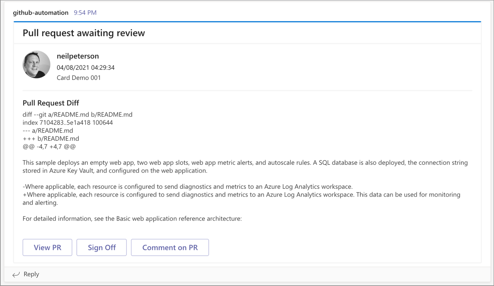

# GitHub pull request notification automation

This solution provides an MS Teams notification when scheduled or expected pull requests have not been addressed after a pre-determined time. The notification includes details about the pull request, including diff information. The notification also provides automation for adding a pre-determined / fixed comment to the pull request.



## Solution components

The logic for this solution is split between two Azure Functions.

- **github-pr-teams-notification** - Time trigger-based Azure Function that uses the GitHub pulls API to identify all pull requests that have a name that matches a filter value and that have been open for a pre-determined time. Once detected, the GitHub pull request diff API is used to get and format the pull request difff. This function then sends the notification to a Teams webhook.
- **github-pr-teams-comment** - Webhook-based Azure Function that is engaged by the notification card. Once engaged, this function adds a comment to the pull request. 

In addition to the Azure Functions, this solution includes Azure Key Vault for storing sensitive application values, Azure Log Analytics workspace for storing solution logs. An Azure Monitor alert is also configured to send a notification email if function execution fails for any reason.

## Configuration

To configure this solution:

- First, create a Teams webhook on the target Teams channel (docs).
- Deploy the templates found in this repository (instructions).
- Add the Azure functions app webhook from the commenting function to the notification function's app settings (instructions).

## Solution deployment parameters

These values are needed when deploying the solution. At deployment time, you are prompted for each.

| Parameter | Type | Description |
|---|---|---|
| GitHubPAT | securestring | GitHub personal access token. |
| TeamsWebHook | string | Teams webhook URI. |
| PullRequestsAPI | string | Address of the pulls api for the target GitHub repository ([docs](https://docs.github.com/en/rest/reference/pulls)). |
| PullRequestTitleFilter | string | Pull requests are filtered on this value. |
| DelayDays | int | Only pull requests older than this value are processed. |
| EmailAddress | string | Email address where function failure alerts will be sent. |
| Comment | string | A pre-determined comment that can be applied to the pull request. |
| CommentLabel | string | The value shown on the card comment button. |
| RemoveSourceControll | bool | When true, removes source control integration. |

## Solution deployment

Create a resource group for the deployment.

```azurecli
az group create --name github-pr-teams-notification-004 --location eastus
```

Run the following command to initiate the deployment. When prompted, enter the value for each parameter.

```azurecli
az deployment group create \
    --resource-group github-pr-teams-notification-003 \
    --template-uri https://raw.githubusercontent.com/neilpeterson/github-pr-teams-notification/master/deployment/azuredeploy.json
```

Add `RemoveSourceControll=true` to remove source controll integration.

```azurecli
az deployment group create \
    --resource-group github-pr-teams-notification-004 \
    --template-uri https://raw.githubusercontent.com/neilpeterson/github-pr-teams-notification/master/deployment/azuredeploy.json
    --parameters RemoveSourceControll=true
```

## Configure WebHook on Function

Once the deployment has completed, retrieve the Function webhook address from the comment function, and add this to the Teams notification function's application configuration.